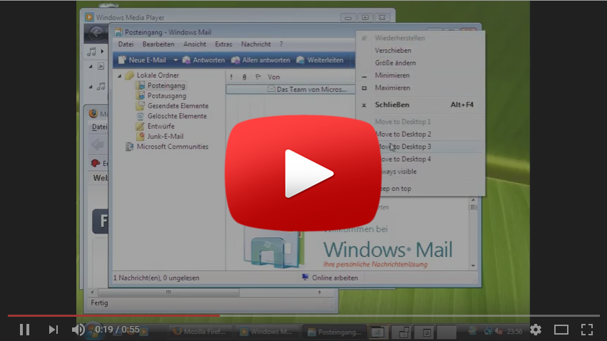

# WindowsPager

*This is a unofficial WindowsPager repository. The source code is taken from [sourceforge/windowspager](https://sourceforge.net/projects/windowspager/).*

WindowsPager is a desktop-switcher/pager for Windows to manage 'virtual' workspaces/desktops by [Jochen Baier](email@jochen-baier.de).

It will integrate smoothly into the desktop panel.

# Features

* virtual desktops, workspaces for Windows 2000/XP/Vista/7/10
* arrange your running applications on different desktops to improve overview
* integration into the panel
* several patterns possible
* 64 bit support
* move windows between desktops by drag 'n drop or by using the window menu
* optional keyboard shortcuts for switching the desktop
* set a window "sticky": always visible
* "Mini-Windows" give an overview from each desktop
* support for "Flashing-Windows" (notify for new messages in Mirc for example)
* keep a window above all others by selecting "Keep on top" from the window menu
* drag `n drop between desktops
* dual/multi monitor support
* no administrator rights necessary
* no installation
* safe: automatic window restore even on crash by use of two separate processes.

# Documentation

## Download

[See release](https://github.com/zwcloud/WindowsPager/releases).

## Installation
Copy the folder 'windowspager' (or 'windowspager64bit')  to a place of your choice. Administrator rights are not necessary. 

## Configuration
Default 4 virtual desktops will be created. To change this, change the values 'rows' and 'columns' in the file 'windowspager.ini'.
You can also change the keyboard shortcuts, trayicon support, etc in this file.

## Run
* Start 'windowspager.exe'.
* Add a symbolic link to the autostart folder for automatic start during Windows startup.

## Usage

**Switch to another desktop:**

- left single-click on the wanted "preview-desktop" inside the pager window or...
- use the keyboard shortcut 'Control-Win-NumpadNumber' (NumLock must be active) or ...
- go to the left/right desktop  with 'Control-Win-(Left/Right)-Arrow key'

**Move a window from one desktop to another:**

- left click on a mini-window for a short time until the cursor changed to a hand,  now drag the mini-window
  from one preview-desktop to another or...

    - use the windows menu (right click on window title or tasklist button) and select a "Move to ..." item or...
    - press 'Control-Win-Alt-(Left/Right)-Arrow key' to move the active window to the left/right(/above/below) desktop or...
    - press 'Control-Win-Alt-Numpad Key', to move the active window to a certain desktop

**Set a window always visible:**

- select "Always visible" from the window menu

**Set a window "On top" of all other windows**

- Select "Keep on top" from the window menu

**Drag 'n drop between desktops:**
- with the object selected (text file for example), hold the mouse for a short amount of time over a preview-desktop to switch to this desktop. You can not drop it directly to the pager window.

**MoveAndSwitch:**

-a new feature is to move a window to an other desktop and switch to this desktop automatically. To do this you must press the Control key during the use of  the "Move to desktop x" menu.

**Note:**
    
* not all programs will work:

  - CMD Window (DOS window): This window is very special. The right click window menu do not work
    and no mini window support.
  - Skype: it is working but without manager support
  - Internet Explorer 7: working but mini window is not updated on resize/move, IE8 works perfect
  - programms running with a different user account (admin) will not work
  - if an application is not working - let me know.   
  - disable tray icons can get some programms working     

* I recommend to disable "Animate windows when minimizing and maximizing" and "Slide taskbar buttons" in the Performance Settings of Windows (My Computer-&gt;Right click-&gt;Advanced Tab-&gt;Performance Settings)

**If a programm is not visible anymore:**

1.  select the programm button in the tasklist
2.  press alt-space
3.  select "move"
4.  press the arrow keys for a while
5.  move the mouse 
6.  let me know

# Author

(c) 2007, 2008, 2009, 2010, 2011 Jochen Baier, [*email@jochen-baier.de*](mailto:email@jochen-baier.de)  
Thanks to [*http://www.codeproject.com*](http://www.codeproject.com) for a lot of good tricks.  
Homepage: [*http://windowspager.sourceforge.net/*](http://windowspager.sourceforge.net/)

# Licence

GPL Version 2
